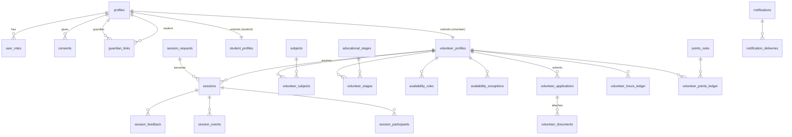

# ERD — AND MORE (v2)

## Data dictionary (key tables)

| Table | Purpose | Hard rules |
|---|---|---|
| `profiles` | 1:1 auth.users identity, minimal PII | no national IDs; first_name + last_initial publicly |
| `user_roles` | multi-role, `no_student_admin` CHECK | student never holds admin roles |
| `guardian_links` | minors model | under-18 requires active guardian link |
| `consents` | versioned consent | unique (user, type, version) |
| `volunteer_applications` | pipeline state machine | DB-enforced transitions via `application_transitions` |
| `volunteer_documents` | private bucket metadata | reviewer-only access, audited |
| `sessions` | bookings | GIST exclusion: no volunteer/student overlap (§9 HARD) |
| `session_feedback` | ratings | unique per (session, user); public only opt-in + moderated |
| `volunteer_hours_ledger` | append-only hours | UPDATE/DELETE blocked by trigger |
| `audit_logs` | append-only audit | UPDATE/DELETE blocked by trigger |

## State machines

- Application: `draft → submitted → under_review → (interview_scheduled) → approved | rejected | needs_more_info`
- Session: `requested → under_review → matched → pending_volunteer_confirmation → confirmed → in_progress → completed → evaluated` (+ cancellations/no-shows/expired/disputed)

Both enforced by DB trigger against a reference transitions table, mirrored in `src/lib/state/`.
